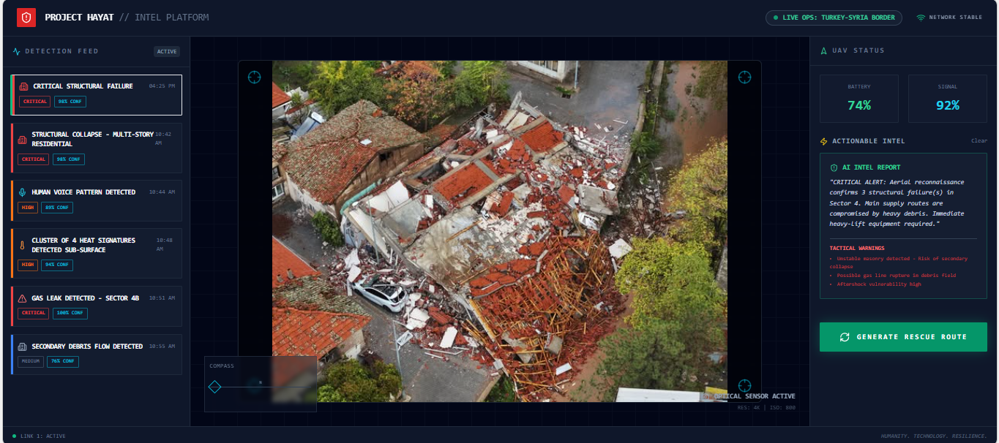

# Project Hayat (مشروع حياة)
### AI-Augmented Urban Search & Rescue (USAR) Intelligence Platform


> *"And whoever saves one [life] - it is as if he had saved mankind entirely."* (Quran 5:32)

---

## 📸 Mission Control Dashboard

> *Live view: Multimodal sensor fusion detecting structural collapse (Red) and human distress signals (Cyan) on a tactical map.*

---

## 🚨 The Mission
**Project Hayat** is a Rapid Response Command & Control (C2) platform designed to win the "Golden Hour" following catastrophic seismic events. 

In the chaos of the **2023 Kahramanmaraş Earthquake**, rescuers faced three critical "Blind Spots":
1.  **Visual Blindness:** Inability to distinguish between "damaged" and "collapsed" structures from altitude.
2.  **Signal Noise:** Difficulty isolating faint human cries for help from heavy machinery noise.
3.  **Logistical Deadlock:** Aid convoys routing through destroyed roads due to outdated maps.

**Hayat** solves this by fusing **Computer Vision**, **Deep Audio Filtering**, and **Geospatial Intelligence** into a unified tactical dashboard.

---

## ⚡ Core Capabilities (v2.0)

### 1. "Eagle Eye" - Visual Damage Assessment
*   **Tech:** Ultralytics YOLOv8 (Fine-tuned on Turkey 2023 Earthquake Dataset).
*   **Function:** Real-time drone imagery analysis.
*   **Output:** Detects and flags **CRITICAL FAILURE** (Pancaked structures) vs **STRUCTURAL INTEGRITY** (Safe zones).

### 2. "The Listener" - Bio-Signal Extraction
*   **Tech:** ResNet18 trained on Mel-Spectrograms (Librosa).
*   **Function:** Filters drone propeller noise to detect specific frequency signatures of **Human Screams/Distress**.
*   **Output:** Generates "Cyan Alerts" for biological presence even in low-visibility conditions.

### 3. "The Navigator" - Tactical Mapping
*   **Tech:** Leaflet / CartoDB Dark Matter.
*   **Function:** Dynamic plotting of AI detections on a live satellite grid.
*   **Output:** Auto-generates safe logistics routes avoiding "Red Zones" (Collapsed buildings).

---

## 🛠️ Technical Architecture

### The "Triad" Stack
| Component | Technology | Role |
| :--- | :--- | :--- |
| **Eye (Vision)** | **YOLOv8 Custom** | Structural Damage Detection. |
| **Ear (Audio)** | **ResNet18 + Librosa** | Spectrogram Classification (Scream vs Noise). |
| **Brain (API)** | **FastAPI (Python)** | Async inference engine serving <100ms predictions. |
| **Face (UI)** | **React + Vite + Leaflet** | Low-latency "Command Center" dashboard. |
| **Deployment** | **Docker Compose** | CPU-Optimized containers for edge deployment. |

---

## 🚀 Deployment (Ghost Protocol)

Project Hayat is containerized for instant deployment on local hardware or cloud servers.

### Prerequisite
*   Docker Desktop installed.

### Quick Start
```bash
# 1. Clone the repo
git clone https://github.com/MdEhsanulHaqueKanan/project-hayat.git
cd project-hayat

# 2. Launch the System (Builds optimized CPU containers)
docker-compose up --build
```

*   **Frontend:** http://localhost:3000
*   **Backend:** http://localhost:8000/docs

---

## 🤝 Project Legacy & Impact
> *"Intercepting Time to Save Lives."*

This project serves as a technical proof-of-concept for:
1.  **AFAD (Turkey):** Automated damage assessment.
2.  **KSrelief (KSA):** Smart humanitarian logistics.
3.  **NEOM (Saudi Arabia):** Cognitive city resilience systems.

---

**Author:** 
Md. Ehsanul Haque Kanan
AI Engineer
Dhaka, Bangladesh
